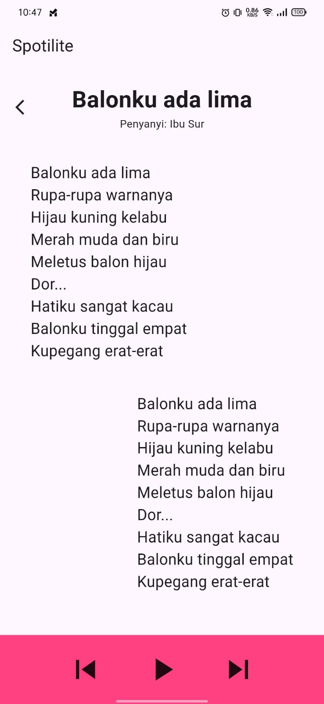

# Laporan praktikum minggu 3

Fijriati rahmatur rizqi - 244107020069

Kelas: TI 3C

# Gambar Tampilan Aplikasi

## Penjelasan Kode Program

Praktikum ini berisi aplikasi Flutter pemutar lirik lagu (**Spotilite**) serta penerapan konsep Pemrograman Berorientasi Objek (OOP) menggunakan bahasa Dart.

---

### 1. `lib/lirik.dart`
File ini mendefinisikan model data **`Lirik`** untuk menyimpan informasi lagu.

* **Atribut / Property:**
  * `judul` (`String`): Menyimpan judul lagu.
  * `penyanyi` (`String`): Menyimpan nama penyanyi.
  * `lirik` (`String`): Menyimpan teks lirik lagu.
* **Constructor:**
  * `Lirik({required this.judul, required this.penyanyi, required this.lirik})`: Menggunakan *named parameters* wajib (`required`) untuk membuat instansi objek `Lirik`.

---

### 2. `lib/mahasiswa.dart`
File ini mendefinisikan class **`Mahasiswa`** sebagai contoh pemodelan objek OOP Dart.

* **Atribut / Property:**
  * `nama` (`String`): Nama mahasiswa.
  * `umur` (`int`): Umur mahasiswa.
  * `kelas` (`String`): Kelas mahasiswa.
* **Method:**
  * `tampilkanInfo()`: Mencetak data mahasiswa (`nama`, `umur`, `kelas`) ke konsol.

---

### 3. `lib/main.dart`
File utama (*entry point*) aplikasi Flutter **Spotilite**.

* **Fungsi `main()`:**
  * Titik awal eksekusi program yang memanggil `runApp(const Fijri())`.
* **Widget `Fijri` (`StatelessWidget`):**
  * Merupakan root widget yang membungkus antarmuka aplikasi menggunakan `MaterialApp` dan `Scaffold`.
  * Membuat objek `Lirik` dengan data lagu *"Balonku ada lima"* ciptaan *"Ibu Sur"*.
* **Struktur Tampilan (UI Layout):**
  * **AppBar**: Menampilkan judul aplikasi `'Spotilite'`.
  * **Header Informasi Lagu**: Menggunakan kombinasi `Row` dan `Column` untuk menampilkan ikon navigasi, judul lagu, serta nama penyanyi.
  * **Bagian Lirik**: Menggunakan `Column`, `Container`, dan `Align` untuk menampilkan teks lirik lagu (`lagu.lirik`).
  * **Bottom Navigation Bar**: Kontrol pemutar musik bagian bawah berwarna `Colors.pinkAccent` yang memuat tombol navigasi (`skip_previous`, `play_arrow`, dan `skip_next`).

