# Laporan Praktikum 5 - Pemrograman Mobile

**Fijriati Rahmatur Rizqi** - 244107020069  
**Kelas:** TI 3C  

---

## Gambar Tampilan Aplikasi & Output

Berikut adalah hasil screenshot tampilan antarmuka dan fitur-fitur yang telah diimplementasikan pada aplikasi **Spotilite**:

### 1. Tampilan Utama Pemutar Musik & Lirik
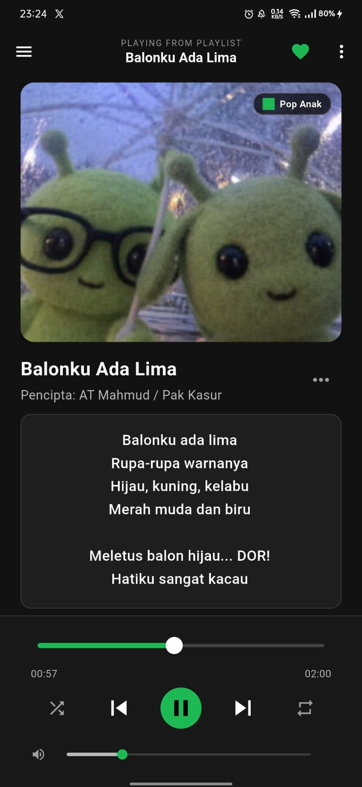

### 2. Navigation Drawer (Menu Navigasi Samping)
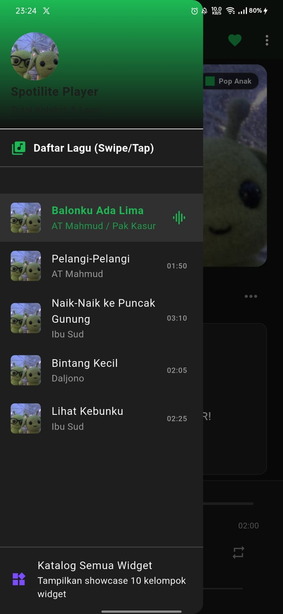

### 3. Menu Pop-up Toolbar (PopupMenuButton)
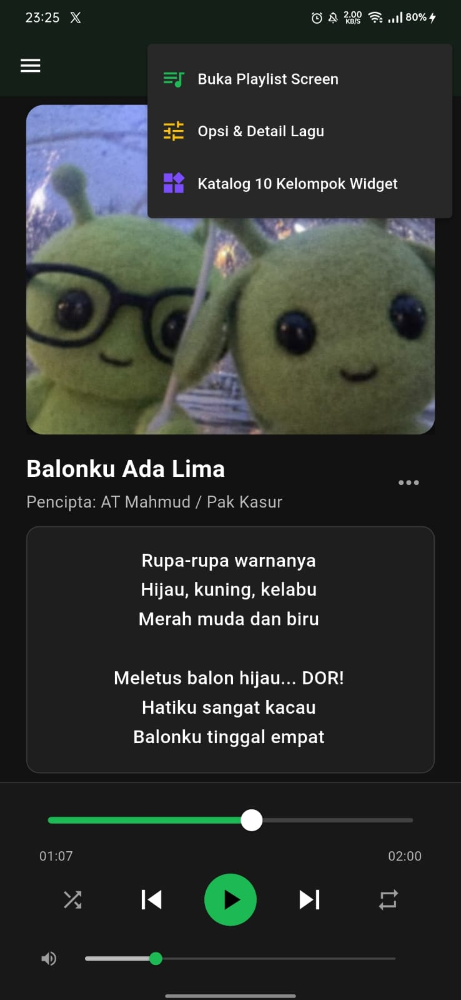

### 4. BottomSheet Opsi & Detail Lagu
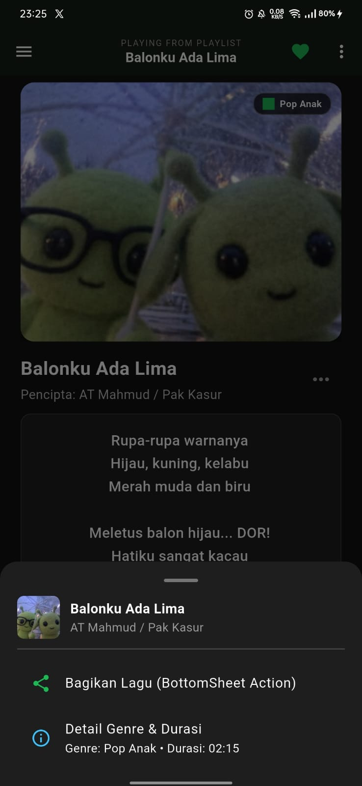

### 5. Custom Icon & Name App

### 6. Tooltip Indikator Status Favorit
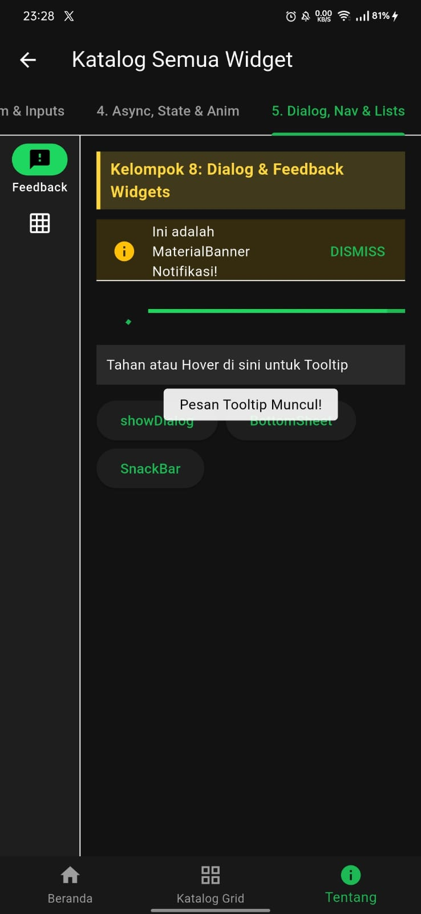

### 7. Bottom Navigation Bar
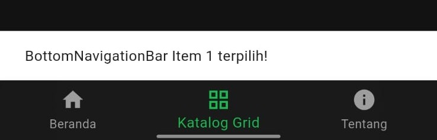

### 8. Halaman Playlist
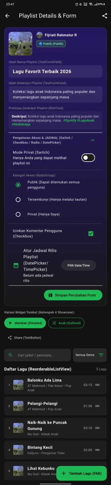

### 9. Form Input Widget
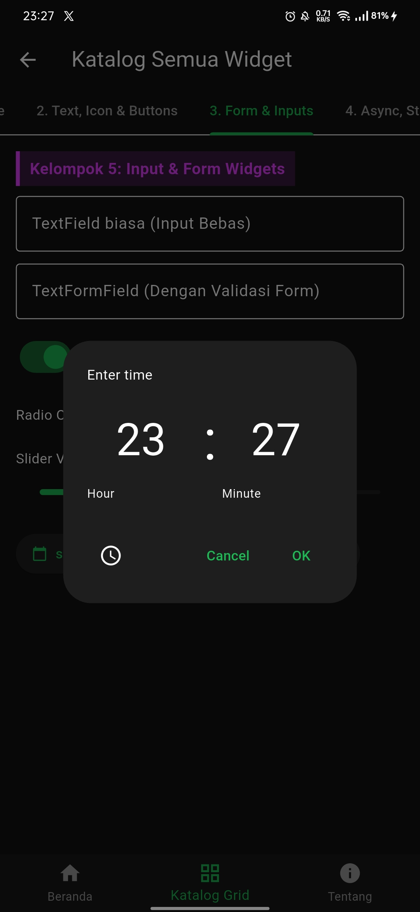

### 10. Dialog Modal Tambah Lagu Baru
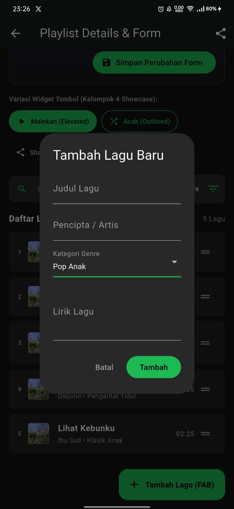

### 11. Widget Layout & Structure
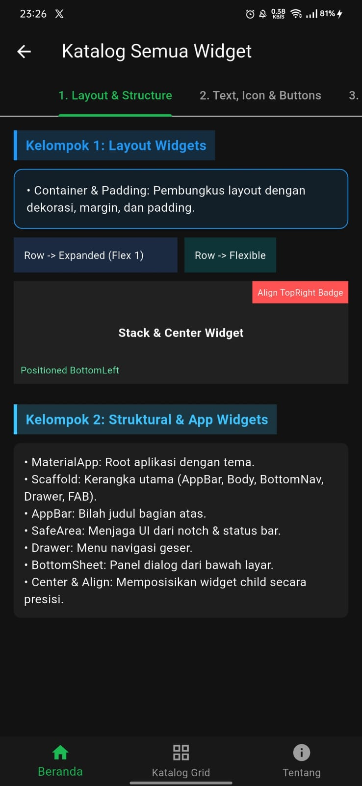

### 12. Widget Text, Icon & Buttons
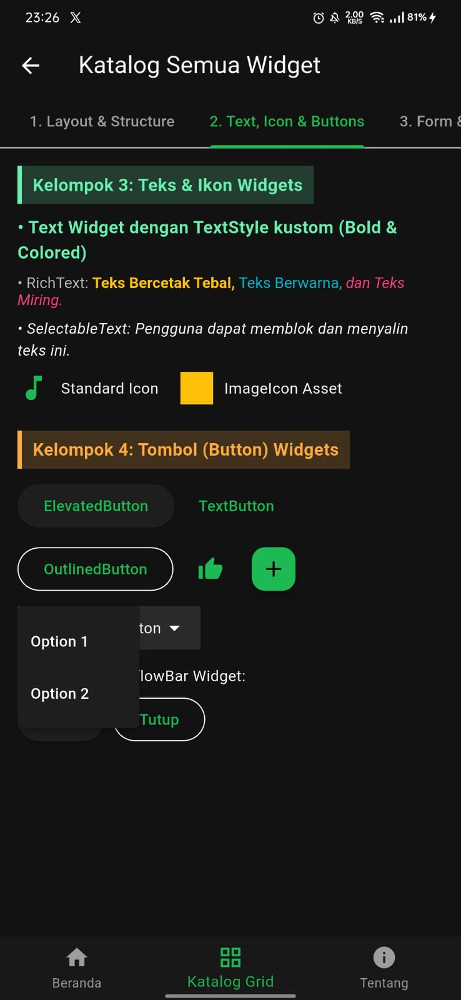

### 13. Widget Async, State Management & Animasi
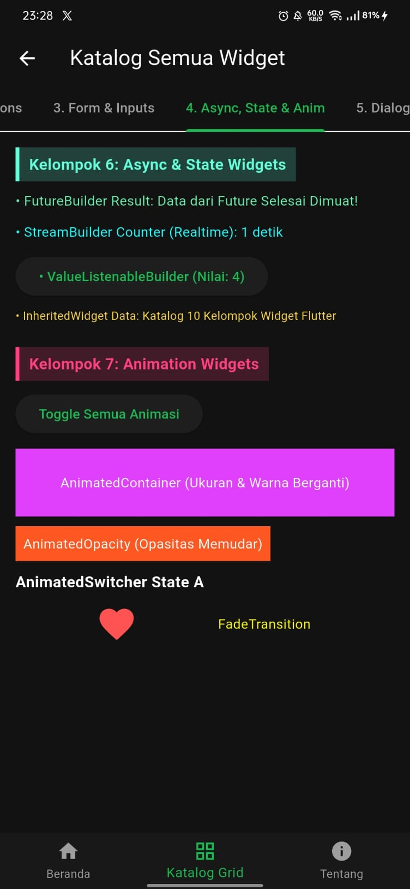

### 14. Widget Dialog, Feedback & Navigasi
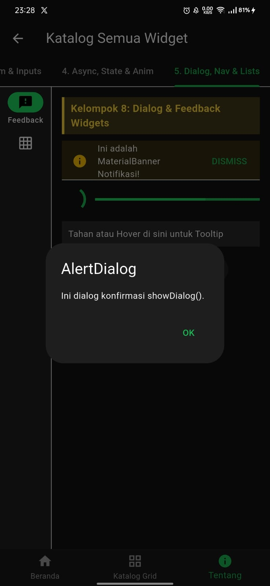

### 15. Widget GridView & CustomScrollView Slivers
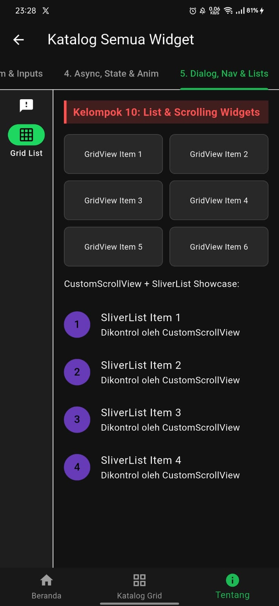

---

## Penjelasan Fitur Aplikasi & Implementasi 10 Kelompok Widget

Aplikasi **Spotilite** dikembangkan sebagai aplikasi pemutar lirik lagu dan pengelola playlist modern berbasis Flutter dengan menerapkan seluruh **10 Kelompok Widget Flutter** secara komprehensif. Berikut adalah penjelasan detail mengenai kemampuan aplikasi dan penerapannya:

### A. Kemampuan Aplikasi (Fitur Utama)

1. **Pemutar Lirik & Audio Real-Time (`music_player_screen.dart`)**:
   - Memutar audio lagu fisik `.mp3` secara lokal menggunakan package `audioplayers`.
   - Menampilkan cover album berformat carousel interaktif yang dapat digeser (`PageView`).
   - Menyediakan fitur *seek* progres lagu melalui `Slider` interaktif dan tombol pengatur waktu audio.
   - Kontrol pengatur volume suara secara responsif menggunakan `ValueNotifier` dan `ValueListenableBuilder`.
   - Menampilkan lirik lagu yang dapat diblok dan disalin oleh pengguna (`SelectableText`).
   - Menandai lagu favorit dengan ikon responsif beserta `Tooltip` dan notifikasi `SnackBar`.

2. **Manajemen Playlist & Formulir Input (`playlist_screen.dart`)**:
   - Mengubah nama dan deskripsi playlist secara dinamis menggunakan `TextFormField` lengkap dengan validasi.
   - Pratinjau deskripsi playlist secara *live* (`RichText`).
   - Mengatur status privasi playlist dengan `Switch` (Publik / Privat).
   - Memilih tipe aksesibilitas playlist dengan `RadioGroup` & `RadioListTile`.
   - Mengaktifkan/mematikan izin komentar dengan `CheckboxListTile`.
   - Menentukan jadwal rilis playlist secara interaktif menggunakan pemilih tanggal (`showDatePicker`) dan waktu (`showTimePicker`).
   - Menata ulang urutan lagu pada playlist secara *drag-and-drop* dengan `ReorderableListView`.
   - Menambah lagu baru ke koleksi playlist melalui dialog modal (`AlertDialog`).
   - Fitur pencarian lagu berdasarkan judul/pencipta (`TextField`) dan filter genre (`DropdownButton`).

3. **Showcase Katalog Widget Lengkap (`widget_catalog_screen.dart`)**:
   - Layar khusus untuk mendemonstrasikan seluruh 10 kelompok widget Flutter secara terstruktur dalam format multi-tab (`TabBar` & `TabBarView`), `NavigationRail`, dan `BottomNavigationBar`.

---

### B. Penjelasan Detail Implementasi 10 Kelompok Widget Flutter

#### 1. Kelompok 1: Layout Widgets
* **Penjelasan:** Widget yang digunakan untuk mengatur posisi, ukuran, susunan, dan penataan tata letak visual aplikasi.
* **Widget yang Digunakan:** `Container`, `Padding`, `Row`, `Column`, `Stack`, `Align`, `Center`, `Expanded`, `Flexible`, `SizedBox`, `Positioned`.
* **Penerapan dalam Kode:**
  - `Row` & `Column`: Digunakan pada seluruh layar untuk menyusun elemen secara horizontal maupun vertikal.
  - `Stack` & `Positioned` / `Align`: Digunakan pada cover album di `music_player_screen.dart` untuk menimpa badge genre di atas gambar album.
  - `Expanded` & `Flexible`: Memastikan lirik lagu dan daftar item menyesuaikan sisa ruang layar secara responsif tanpa *overflow*.

#### 2. Kelompok 2: Struktural & App Widgets
* **Penjelasan:** Widget pembentuk kerangka dasar aplikasi sesuai standar Material Design.
* **Widget yang Digunakan:** `MaterialApp`, `Scaffold`, `AppBar`, `SafeArea`, `Drawer`, `BottomSheet`.
* **Penerapan dalam Kode:**
  - `MaterialApp`: Root aplikasi pada `lib/main.dart` yang mendefinisikan tema gelap (Dark Theme Spotify).
  - `Scaffold`: Kerangka utama layar memuat `appBar`, `body`, `drawer`, `bottomNavigationBar`, dan `floatingActionButton`.
  - `SafeArea`: Membungkus konten agar tidak tertutup *notch* atau status bar perangkat.
  - `Drawer`: Panel navigasi samping berisi header info akun dan daftar lagu yang dapat diklik.

#### 3. Kelompok 3: Teks & Ikon Widgets
* **Penjelasan:** Widget untuk menampilkan teks berformat, gaya tipografi, dan elemen visual ikonik.
* **Widget yang Digunakan:** `Text`, `TextStyle`, `RichText`, `SelectableText`, `Icon`, `ImageIcon`.
* **Penerapan dalam Kode:**
  - `Text` & `TextStyle`: Menampilkan judul lagu, nama pencipta, dan durasi dengan warna dan ketebalan huruf teratur.
  - `RichText`: Menampilkan pratinjau deskripsi playlist dengan gabungan gaya teks tebal dan tagar `#Spotify` berwarna hijau pada `playlist_screen.dart`.
  - `SelectableText`: Memungkinkan pengguna memblok dan menyalin lirik lagu pada layar player.
  - `ImageIcon`: Menampilkan gambar aset lokal sebagai ikon penanda genre pada cover album.

#### 4. Kelompok 4: Tombol (Button) Widgets
* **Penjelasan:** Elemen interaktif untuk memicu aksi, navigasi, atau pengiriman formulir.
* **Widget yang Digunakan:** `ElevatedButton`, `TextButton`, `OutlinedButton`, `IconButton`, `FloatingActionButton`, `PopupMenuButton`, `OverflowBar`.
* **Penerapan dalam Kode:**
  - `IconButton`: Digunakan untuk kontrol pemutar musik (Play, Pause, Next, Previous) dan tombol aksi favorit.
  - `PopupMenuButton`: Menampilkan opsi menu titik tiga di AppBar untuk navigasi cepat.
  - `FloatingActionButton` (FAB): Tombol melayang di layar playlist untuk memicu modal dialog "Tambah Lagu".
  - `ElevatedButton`, `OutlinedButton`, `TextButton`: Ditampilkan pada variasi tombol di `playlist_screen.dart` dan katalog widget.

#### 5. Kelompok 5: Input & Form Widgets
* **Penjelasan:** Widget untuk mengumpulkan input data dari pengguna secara terstruktur.
* **Widget yang Digunakan:** `Form`, `TextField`, `TextFormField`, `Switch`, `SwitchListTile`, `CheckboxListTile`, `RadioGroup`, `RadioListTile`, `Slider`, `DropdownButton`, `showDatePicker`, `showTimePicker`.
* **Penerapan dalam Kode:**
  - `Form` & `TextFormField`: Memvalidasi input nama playlist, deskripsi, serta modal input lagu baru.
  - `SwitchListTile` & `CheckboxListTile`: Mengatur mode privasi dan izin komentar pada playlist.
  - `RadioGroup` & `RadioListTile`: Memilih salah satu dari 3 opsi kategori aksesibilitas playlist.
  - `Slider`: Mengontrol posisi pemutaran audio (seekbar) serta pengatur volume suara.
  - `showDatePicker` & `showTimePicker`: Menampilkan dialog kalender dan jam untuk menentukan jadwal rilis playlist.

#### 6. Kelompok 6: Async & State Management Widgets
* **Penjelasan:** Widget yang menangani manajemen status (*state*) aplikasi dan pemrosesan data asinkron.
* **Widget yang Digunakan:** `StatefulWidget`, `StatelessWidget`, `InheritedWidget`, `ValueListenableBuilder`, `FutureBuilder`, `StreamBuilder`.
* **Penerapan dalam Kode:**
  - `InheritedWidget` (`MusicAppThemeInherited` pada `inherited_state.dart`): Membagikan data judul aplikasi dan tema secara global ke seluruh *widget tree*.
  - `ValueListenableBuilder`: Memperbarui Slider volume suara secara efisien tanpa melakukan *re-render* pada seluruh layar player.
  - `FutureBuilder` & `StreamBuilder`: Didemonstrasikan pada `widget_catalog_screen.dart` untuk menyimulasikan pemuatan data asinkron dan timer *real-time*.

#### 7. Kelompok 7: Animasi (Animation) Widgets
* **Penjelasan:** Widget untuk memberikan efek visual transisi dan pergerakan halus pada antarmuka.
* **Widget yang Digunakan:** `AnimatedContainer`, `AnimatedOpacity`, `AnimatedSwitcher`, `Hero`, `ScaleTransition`, `FadeTransition`.
* **Penerapan dalam Kode:**
  - `Hero`: Memberikan animasi transisi terbang (*flight transition*) pada cover album dari player screen ke playlist screen.
  - `AnimatedSwitcher`: Memberikan animasi pergantian yang mulus antara ikon Play dan Pause saat lagu diputar.
  - `AnimatedContainer` & `AnimatedOpacity`: Mendemonstrasikan perubahan ukuran, warna, dan tingkat opasitas secara dinamis pada `widget_catalog_screen.dart`.

#### 8. Kelompok 8: Dialog, BottomSheet & Feedback Widgets
* **Penjelasan:** Widget untuk memberikan umpan balik (feedback) atau meminta konfirmasi dari pengguna.
* **Widget yang Digunakan:** `AlertDialog`, `showDialog`, `showModalBottomSheet`, `SnackBar`, `Tooltip`, `MaterialBanner`, `CircularProgressIndicator`, `LinearProgressIndicator`.
* **Penerapan dalam Kode:**
  - `AlertDialog` (`showDialog`): Menampilkan jendela dialog konfirmasi/input lagu baru.
  - `showModalBottomSheet`: Menampilkan lembaran opsi lagu dari bawah layar saat tombol opsi dipencet.
  - `SnackBar`: Menampilkan notifikasi singkat di bagian bawah layar saat lagu ditambah, disukai, atau disimpan.
  - `Tooltip`: Menampilkan petunjuk teks saat pengguna mengarahkan kursor atau menahan tombol favorit.

#### 9. Kelompok 9: Navigasi (Navigation) Widgets
* **Penjelasan:** Widget untuk berpindah antar layar (*routes*) atau mengelola antarmuka multi-halaman.
* **Widget yang Digunakan:** `Navigator`, `PageRouteBuilder`, `MaterialPageRoute`, `TabBar`, `TabBarView`, `BottomNavigationBar`, `NavigationRail`.
* **Penerapan dalam Kode:**
  - `Navigator.push` & `PageRouteBuilder`: Melakukan perpindahan halaman dengan transisi kustom memudar (*FadeTransition*) dari Player Screen menuju Playlist Screen.
  - `TabBar` & `TabBarView`: Mengelola 5 sub-halaman katalog widget pada `widget_catalog_screen.dart`.
  - `BottomNavigationBar` & `NavigationRail`: Menampilkan bilah navigasi bawah dan samping pada katalog widget.

#### 10. Kelompok 10: List & Scrolling Widgets
* **Penjelasan:** Widget untuk menampilkan kumpulan data dalam jumlah banyak yang dapat digulir (*scrolling*).
* **Widget yang Digunakan:** `ListView`, `ListView.builder`, `ReorderableListView`, `PageView`, `GridView`, `SingleChildScrollView`, `CustomScrollView`, `SliverGrid`, `SliverList`, `Scrollbar`.
* **Penerapan dalam Kode:**
  - `PageView.builder`: Membuat carousel cover album yang dapat di-swipe ke kiri/kanan pada player utama.
  - `ReorderableListView.builder`: Memungkinkan pengguna mengubah urutan daftar lagu di playlist dengan cara menarik (*drag & drop*).
  - `ListView.builder`: Menampilkan antrean lagu di dalam Navigation Drawer.
  - `CustomScrollView`, `SliverGrid`, & `SliverList`: Mendemonstrasikan tata letak kisi (*grid*) dan daftar scroll tingkat lanjut pada katalog widget.

---

## Struktur & Penjelasan File Kode Program

Berikut adalah rincian file program pada proyek `prak5`:

### 1. `lib/main.dart`
- **Fungsi:** Merupakan *entry point* aplikasi Spotilite.
- **Isi Utama:**
  - `main()`: Memanggil `runApp(const MyApp())`.
  - `MyApp`: Root widget yang mengonfigurasi `MaterialApp`, tema gelap Spotify (primary color `#1DB954`, background `#121212`), serta membungkusnya dengan `MusicAppThemeInherited`.
  - `MainMusicContainer`: State manager pusat yang menyimpan status daftar lagu (`List<Lirik>`), indeks lagu aktif, metadata playlist, serta fungsi *handler* (`selectSong`, `nextSong`, `previousSong`, `addSong`, `reorderSongs`, `updatePlaylistDetails`).

### 2. `lib/lirik.dart`
- **Fungsi:** Mendefinisikan class model data lagu dan menyediakan data awal (*sample data*).
- **Isi Utama:**
  - Class `Lirik`: Atribut `id`, `judul`, `pencipta`, `lirik`, `duration`, `imageAsset`, `audioAsset`, `isFavorite`, dan `genre`.
  - Fungsi `getSampleSongs()`: Mengembalikan daftar 5 lagu anak populer Indonesia (Balonku Ada Lima, Pelangi-Pelangi, Naik-Naik ke Puncak Gunung, Bintang Kecil, Lihat Kebunku).

### 3. `lib/widgets/inherited_state.dart`
- **Fungsi:** Mengimplementasikan **Kelompok 6 (InheritedWidget)**.
- **Isi Utama:**
  - Class `MusicAppThemeInherited`: Menyarankan status global seperti judul aplikasi (`appTitle`), mode tema (`currentThemeMode`), dan fungsi *toggle theme*.
  - Method `of(context)`: Memungkinkan widget anak di seluruh pohon widget mengakses data state secara efisien.

### 4. `lib/screens/music_player_screen.dart`
- **Fungsi:** Layar pemutar musik dan lirik lagu utama (`Fijri`).
- **Isi Utama:**
  - Menginisialisasi `AudioPlayer()` dari package `audioplayers` untuk mendengarkan *stream* status pemutaran (`onDurationChanged`, `onPositionChanged`, `onPlayerStateChanged`).
  - Mengelola `PageController` untuk sinkronisasi carousel cover album dengan indeks lagu terpilih.
  - Menampilkan `AppBar` dengan `Tooltip`, `IconButton` favorit, dan `PopupMenuButton`.
  - Menampilkan `Drawer` navigasi samping dengan info akun dan daftar lagu.
  - Menampilkan body berisi cover album (`PageView` & `Hero`), informasi judul/pencipta lagu, serta area lirik lagu (`SelectableText` di dalam `SingleChildScrollView`).
  - Menampilkan `bottomNavigationBar` berisi seekbar `Slider`, kontrol play/pause (`AnimatedSwitcher`), dan volume bar slider (`ValueListenableBuilder`).

### 5. `lib/screens/playlist_screen.dart`
- **Fungsi:** Layar manajemen dan detail playlist (`SpotifyPlaylistScreen`).
- **Isi Utama:**
  - Formulir `Form` dengan `TextFormField` untuk mengubah nama & deskripsi playlist secara live preview dengan `RichText`.
  - Fitur pengatur privasi & aksesibilitas menggunakan `SwitchListTile`, `RadioGroup`, dan `CheckboxListTile`.
  - Pengatur jadwal rilis menggunakan `showDatePicker` & `showTimePicker`.
  - Variasi tombol (`ElevatedButton`, `OutlinedButton`, `TextButton`).
  - Bilah pencarian (`TextField`) & filter genre (`DropdownButton`).
  - Daftar lagu interaktif yang dapat diubah urutannya (`ReorderableListView.builder`).
  - Dialog modal `AlertDialog` untuk menambah lagu baru (`FloatingActionButton`).

### 6. `lib/screens/widget_catalog_screen.dart`
- **Fungsi:** Showcase lengkap katalog 10 kelompok widget Flutter (`WidgetCatalogScreen`).
- **Isi Utama:**
  - Menggunakan `DefaultTabController` dengan 5 Tab utama (`TabBar` & `TabBarView`).
  - Tab 1: Layout & Structural Widgets (Kelompok 1 & 2).
  - Tab 2: Text, Icons & Button Varieties (Kelompok 3 & 4).
  - Tab 3: Form & Inputs Showcase (Kelompok 5).
  - Tab 4: Async, State & Animation Showcase (Kelompok 6 & 7).
  - Tab 5: Dialog, NavigationRail, GridView, & CustomScrollView Slivers (Kelompok 8, 9, & 10).
