|            | Pemrograman Mobile |
| ---------- | ------------------ |
| NIM        | 244107020069       |
| Nama       | Fijriati Rahmatur Rizqi |
| Kelas      | TI - 3C |
| Repository | [link] (https://github.com/rhmau1/pemrograman_mobile) |

# Hasil praktikum
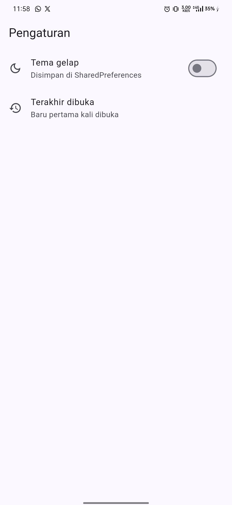
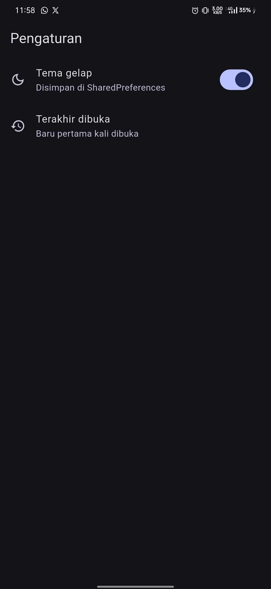

# Pertanyaan Praktikum 1

1. Mengapa SharedPreferences.getInstance() tidak boleh dipanggil di dalam method build() widget?
    - Jawab: 
    Karena SharedPreferences.getInstance() adalah operasi asynchronous yang membutuhkan waktu untuk mengakses memori perangkat. Jika dipanggil di dalam method build() widget, maka setiap kali widget di-rebuild, operasi ini akan dipanggil berulang kali. Hal ini dapat menyebabkan penurunan performa pada aplikasi karena operasi akses disk yang berlebihan.

2. Jelaskan alur data dari saat switch ditekan sampai nilai tersimpan di disk dan tema berubah.
    - Jawab:
    1. Saat switch ditekan, method toggle() pada DarkModeNotifier dipanggil.
    2. Nilai isDark dibalik (dari true menjadi false atau sebaliknya).
    3. State diupdate dengan nilai baru menggunakan AsyncData(next).
    4. Riverpod memicu rebuild pada widget yang menggunakan provider ini, sehingga UI langsung berubah tanpa menunggu penyimpanan selesai.
    5. Secara bersamaan, ref.read(prefsRepositoryProvider).setDarkMode(next) dipanggil untuk menyimpan nilai ke SharedPreferences di latar belakang.
    6. Jika operasi penyimpanan berhasil, nilai tetap tersimpan. Jika gagal, state akan dikembalikan ke nilai sebelumnya.

3. Apa kelebihan dan risiko pendekatan optimistic update pada toggle()? 
    - Jawab:
        
        Kelebihan:
        - User experience yang lebih baik karena UI langsung berubah tanpa menunggu operasi penyimpanan selesai.
        - Pengurangan delay karena UI tidak perlu menunggu respons dari disk.

        Risiko:
        - Jika operasi penyimpanan gagal, UI akan menampilkan nilai yang salah sampai state dikembalikan ke nilai sebelumnya.   

# Pertanyaan Praktikum 2
1. Mengapa kolom dirty bertipe INTEGER dan bukan BOOLEAN?
    - Jawab: 
    Karena Sqflite belum mendukung tipe BOOLEAN secara native. Oleh karena itu, digunakan INTEGER untuk menyimpan nilai boolean dengan representasi 0 (false) dan 1 (true).
2. Apa fungsi parameter openDb pada constructor NoteRepository?
    - Jawab: 
    Parameter openDb berfungsi untuk memberikan fleksibilitas dalam membuat instance NoteRepository. Hal ini memungkinkan kita untuk menggunakan instance database yang sama di seluruh aplikasi tanpa perlu membuat instance baru setiap kali memanggil NoteRepository. Selain itu, parameter ini juga memudahkan dalam melakukan mocking database pada saat pengujian.
3. Mengapa query memakai where: 'id = ?' dan whereArgs, bukan interpolasi string?
    - Jawab: 
    Menggunakan where: 'id = ?' dan whereArgs merupakan praktik keamanan untuk mencegah serangan SQL injection. Dengan menggunakan placeholder, nilai parameter akan di-escape secara otomatis oleh Sqflite, sehingga nilai parameter tidak akan dieksekusi sebagai bagian dari query SQL.
4. Apa yang terjadi jika Anda menambah kolom baru di onCreate tanpa menaikkan version?
    - Jawab: 
    Jika Anda menambah kolom baru di onCreate tanpa menaikkan version, maka database akan di-create ulang dengan skema baru, namun data yang sudah ada sebelumnya akan hilang karena database di-reset. Oleh karena itu, setiap kali ada perubahan pada skema database, version harus dinaikkan untuk memastikan data yang sudah ada tetap terjaga. Jika kelak menambah kolom (misalnya pinned), naikkan `version` dan tambahkan onUpgrade. Tanpa ini, perangkat yang sudah memiliki database lama tidak akan mendapatkan kolom baru.

# Hasil praktikum 3
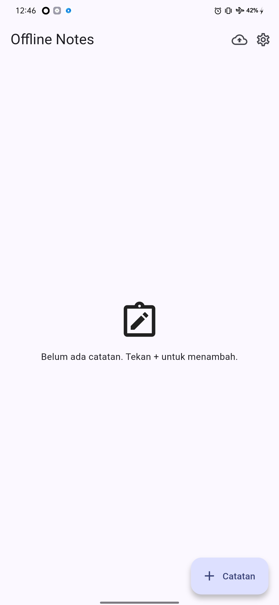
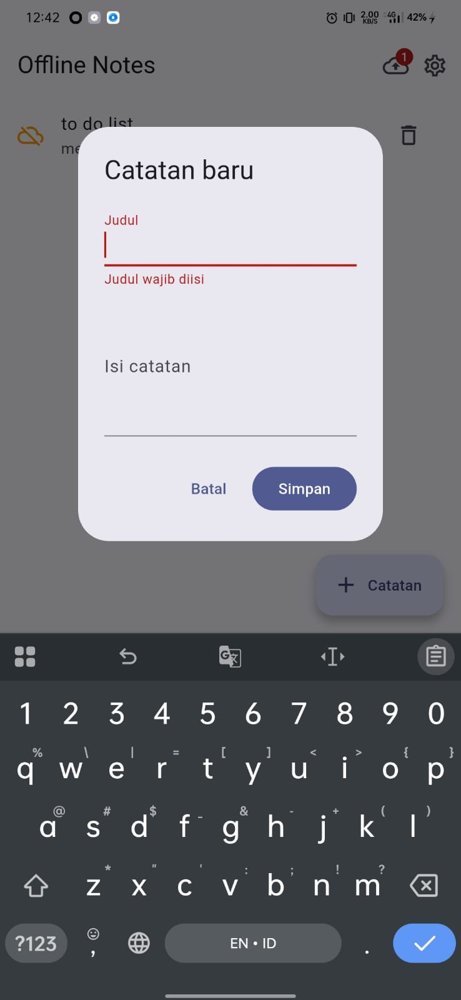
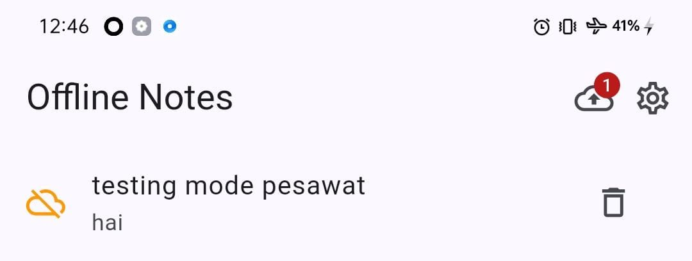
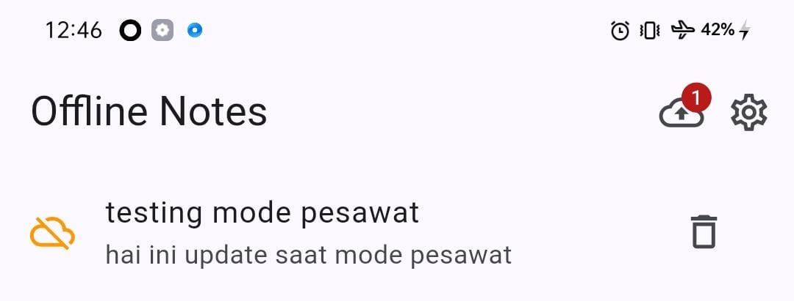

# Pertanyaan Praktikum 3
1. Mengapa setelah setiap mutasi perlu meng-invalidate notesProvider dan dirtyCountProvider? Apa yang terjadi jika hanya salah satu?
- Jawab: 
    Untuk memastikan bahwa state di-refresh setelah setiap mutasi. Jika hanya salah satu yang di-invalidate, maka salah satu provider tidak akan diperbarui, sehingga dapat menyebabkan state yang tidak konsisten.
2. Bagaimana cara Anda memicu state error secara sengaja untuk menguji tampilan _ErrorView?
- Jawab: 
    Misalnya override noteRepositoryProvider dengan repository yang melempar exception, mengubah nama tabel di query sementara, atau melempar exception manual di fetchNotes.
3. Mengapa aplikasi tetap berfungsi dalam mode pesawat walaupun tidak ada kode khusus untuk mode offline?
- Jawab: 
    Karena aplikasi tidak memiliki dependensi eksternal dan semua operasi dilakukan secara lokal di perangkat. Selain itu, aplikasi juga tidak menggunakan layanan berbasis cloud, sehingga tidak memerlukan koneksi internet untuk berfungsi.

# Hasil praktikum 4
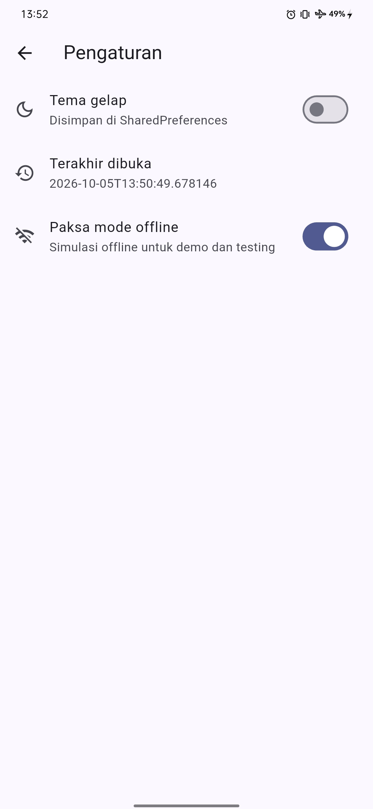
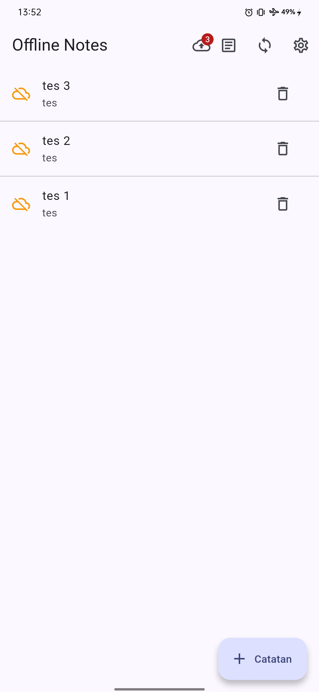
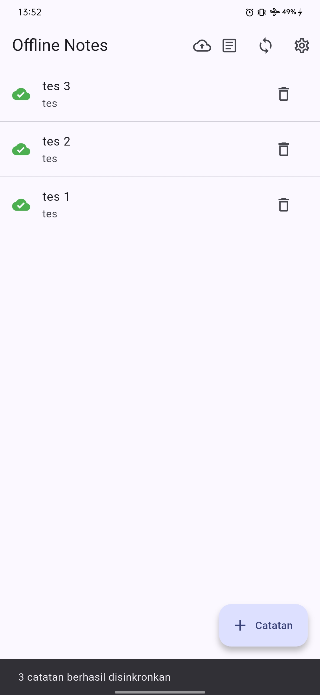
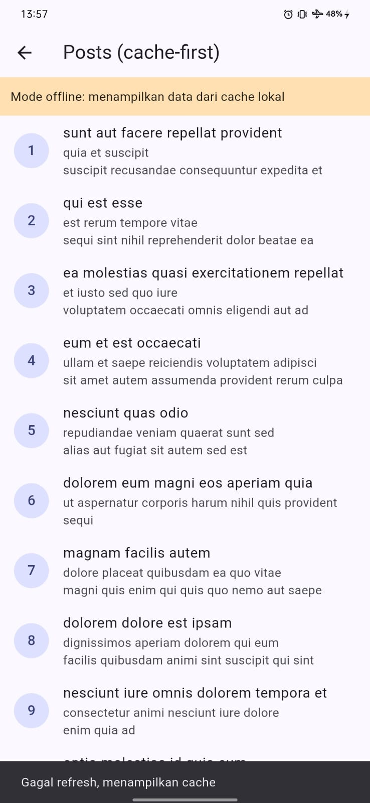

# Pertanyaan Praktikum 4
1. Apa perbedaan cache-first dan network-first? Berikan satu contoh data yang lebih cocok memakai network-first.
- Jawab: 
    Perbedaan utamanya terletak pada urutan prioritas pengambilan data. 
    
    Cache-first: Data diambil dari cache lokal terlebih dahulu. Jika cache kosong atau sudah kadaluarsa (expired), maka data akan diambil dari network. Data yang diambil dari network akan disimpan ke cache untuk digunakan pada permintaan berikutnya.

    Network-first: Data diambil dari network terlebih dahulu. Jika network tidak tersedia (misalnya mode offline), maka data akan diambil dari cache lokal (jika ada). Data yang diambil dari network juga akan disimpan ke cache.

    Contoh data yang lebih cocok memakai network-first adalah data yang harus selalu paling up-to-date atau real-time, seperti: 
    - Harga saham atau cryptocurrency: Nilainya berubah sangat cepat, sehingga cache yang usang bisa menyesatkan. 
    - Status pesanan (order status): Pembeli ingin segera tahu apakah pesanannya sudah diterima atau dikirim, bukan berdasarkan data lama.
    - Skor pertandingan olahraga langsung: Data harus real-time agar akurat.
    - Pembayaran atau transaksi bank: Kesalahan informasi sedikit saja dapat berakibat fatal.
2. Jelaskan skenario kehilangan data yang dapat terjadi akibat markAllSynced(), lalu usulkan perbaikannya.
- Jawab: 
    Skenario kehilangan data yang bisa terjadi akibat markAllSynced() adalah:
    1. Pengguna membuat 10 note baru -> status dirty = true.
    2. Pengguna membuka screen SyncNotes -> memanggil sync() -> memanggil markAllSynced().
    3. markAllSynced() mengubah dirty = false untuk semua 10 note.
    4. Tiba-tiba listrik mati atau HP restart -> database ter-reset.
    5. Saat dibuka lagi, semua 10 note muncul sebagai baru lagi (karena dirty kembali true).
    6. Ini membuat data "palsu" karena aslinya sudah tersimpan di cloud.
    
    Usulan Perbaikan:
    markAllSynced() tidak seharusnya mengubah status dirty menjadi false secara langsung. Sebaiknya markAllSynced() hanya menandai bahwa data "sedang di-sync" atau memindahkan data ke tabel arsip. Atau, jika ingin tetap mengubah dirty menjadi false, harus dipastikan bahwa data tersebut sudah benar-benar aman di cloud. Jika tidak yakin, lebih baik tidak mengubah status dirty atau menggunakan mekanisme backup.
3. Mengapa diperlukan saklar forceOffline padahal sudah ada mode pesawat?
- Jawab:
     saklar forceOffline berguna untuk memanipulasi UI, memungkinkan developer menguji atau mendemonstrasikan bagaimana aplikasi berperilaku dalam kondisi offline tanpa benar-benar mengaktifkan mode pesawat.
4. Mengapa fetchAndCache() menulis cache di dalam transaksi?
- Jawab: 
    Untuk memastikan operasi penghapusan dan penyisipan bersifat atomik. Dengan demikian, jika terjadi kegagalan di tengah operasi (misalnya saat menyisipkan data baru), database akan kembali ke keadaan semula (cache lama tetap utuh) sehingga tidak ada cache setengah jadi yang tersisa.    

# Hasil praktikum 5
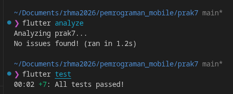

# Pertanyaan Praktikum 5
1. Mengapa kita menguji provider dengan ProviderContainer + overrideWithValue dan bukan dengan membuka database asli?
- Jawab: 
    Cepat, deterministik, berjalan tanpa emulator/plugin, dan fokus menguji logika provider, bukan SQLite.
2. Apa manfaat parameter latency pada syncNotes bagi pengujian?
- Jawab: 
    Parameter latency bermanfaat untuk mengontrol waktu tunggu (delay) sebelum operasi sync dimulai. Hal ini memungkinkan pengembang untuk menguji bagaimana aplikasi berperilaku dalam kondisi jaringan yang lambat atau sibuk. Selain itu, parameter latency juga memudahkan dalam mensimulasikan kondisi jaringan yang berbeda-beda untuk memastikan aplikasi tetap responsif dan tidak membeku selama operasi sync.    
3. Tuliskan satu test tambahan yang menurut Anda penting namun belum ada, beserta alasannya.
- Jawab:
    Contoh: updateNote menandai dirty dan memperbarui updated_at; PostsNotifier mengembalikan cache saat offline; widget test empty state.

# AI Prompt challenge dan refactoring
### Prompt
Aplikasi Flutter Offline Notes: CRUD catatan + preferensi tema.
Bandingkan SharedPreferences, Hive, sqflite (SQLite), dan Drift
untuk dua kebutuhan ini. Requirements:
- Kriteria: kompleksitas query, kebutuhan relasi, reaktivitas (stream),
  type-safety, ukuran boilerplate, dan kemudahan testing.
- Beri rekomendasi final: mana untuk preferensi, mana untuk catatan,
  beserta alasannya dalam 1 tabel.
- Tunjukkan skema tabel/kotak untuk 1000+ catatan.
Jelaskan trade-off setiap pilihan.

•Apakah AI menempatkan daftar catatan di SharedPreferences? (Tolak: rapuh untuk koleksi.)
- Jawab: Tidak, AI memisahkan SharedPreferences hanya untuk preferensi/settings yang sederhana, sedangkan catatan ditempatkan di sqflite/Drift.

•Apakah skema AI mendukung antrean sync (dirty flag / updated_at) atau hanya CRUD polos?
- Jawab: Ya, AI membaca struktur kode yang sudah ada sehingga mendukung antrean sync dengan dirty flag dan updated_at, bahkan menyarankan menambahkan index pada dirty dan updated_at untuk support 1000+ data.

•Apakah klaim “real-time” AI didukung stream (Drift watch) atau hanya asumsi?
- Jawab: AI tidak memberikan klaim "real-time" secara eksplisit tanpa dasar, melainkan menyarankan penggunaan Stream bawaan `drift.watch()` untuk reaktivitas real-time.

•Apakah estimasi boilerplate AI masuk akal setelah Anda mencoba instalasinya (flutter pub add + migrasi skema)?
- Jawab: Estimasi masuk akal, dengan menjelaskan perbandingan antara SharedPreferences, Hive, sqflite (SQLite), dan Drift. Serta dijelaskan keunggulan dan kelemahan setiap pilihan, sehingga bisa membuat kita memahami ingin memilih yang mana menyesuaikan kebutuhan kita.

•Keputusan final Anda beserta alasannya — boleh berbeda dari rekomendasi AI selama berargumen.
- Jawab: Keputusan final tetap menggunakan SharedPreferences dan sqflite untuk project sekarang, namun dengan catatan menambahkan index pada dirty dan updated_at dengan menerapkan `onUpgrade` untuk menangani 1000+ data.

### Tabel Perbandingan Storage
| Kriteria | SharedPreferences | Hive | sqflite | Drift |
|---|---|---|---|---|
| **Kompleksitas query** | Hanya get/set per key primitif. Tidak ada filter, sort, atau aggregate. | Filter & sort manual di memori (Dart). Tidak ada query engine native. | SQL mentah (`WHERE`, `ORDER BY`, `JOIN`, `LIKE`, aggregate, dsb.). | SQL builder / Dart DSL compile-time checked + support raw SQL. |
| **Dukungan relasi** | Tidak ada (flat key-value). | Tidak ada (referensi manual antar box tanpa Foreign Key / FK constraint). | Mendukung Foreign Key, index, trigger, dan cascading updates/deletes. | Mendukung Foreign Key & auto-generate relasi di Dart DSL. |
| **Reaktivitas (stream)** | Tidak ada stream bawaan (perlu polling / manual wrapper). | Ada stream bawaan (`box.watch()` / `listenable`). | Tidak ada stream bawaan (perlu `StreamController` / reactive wrapper manual). | Sangat reaktif (`watch()`, `watchSingle()`) otomatis emit saat data berubah. |
| **Type-safety** | Hanya tipe primitif (`bool`, `int`, `String`). Key string rawan typo. | Type-safe via `TypeAdapter` / class model. | Tidak type-safe (`Map<String, Object?>`), parsing manual rawan error. | Sangat type-safe (compile-time check untuk nama kolom, tipe data, & query). |
| **Ukuran boilerplate** | Sangat kecil (tanpa setup khusus, 2-3 baris per operasi). | Sedikit - sedang (perlu buat `TypeAdapter` per model). | Sedang (perlu SQL string + parsing `toMap`/`fromMap` per model). | Besar (perlu definisi tabel, DAO, dan `build_runner` code generation). |
| **Kemudahan testing** | Sangat mudah (`setMockInitialValues` built-in). | Mudah (inisialisasi `Hive.init(tempDir)` di folder test terisolasi). | Cukup mudah (in-memory DB / inject `openDb` / `sqflite_common_ffi`). | Sangat mudah (`NativeDatabase.memory()` in-memory DB bawaan). |
| **Cocok untuk preferensi?** | **Sangat cocok** (ideal untuk setting sederhana & key-value). | Bisa, tapi berlebihan (overkill untuk data primitif kecil). | Kurang cocok (terlalu kompleks untuk sekadar simpan boolean/string tema). | Tidak cocok (sangat overkill untuk preferensi tema sederhana). |
| **Cocok untuk 1000+ catatan?** | **Tidak cocok** (rapuh untuk koleksi, tidak ada indexing/query). | **Kurang cocok** (load semua data ke RAM, filter/sort di Dart). | **Cocok** (efisien dengan B-tree index di SQLite C-engine). | **Sangat cocok** (performa SQLite + type-safety & reactive stream). |
| **Keputusan & alasan** | **Dipilih untuk preferensi** (ringkas, cepat, built-in, tanpa setup). | Tidak dipilih (nanggung untuk setting, kurang efisien untuk catatan). | **Dipilih untuk catatan** (sudah terimplementasi di prak7, efisien untuk 1000+ data dengan index). | Alternatif ideal (dipilih jika aplikasi berkembang butuh reactive stream & type-safety). |

# Hasil refactoring
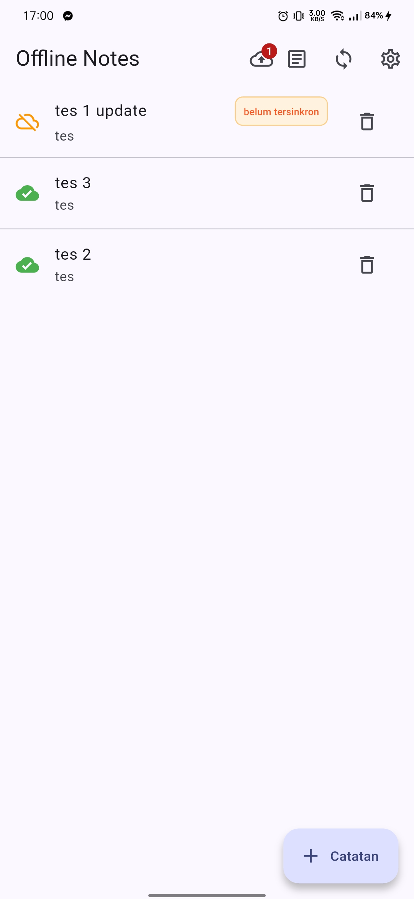
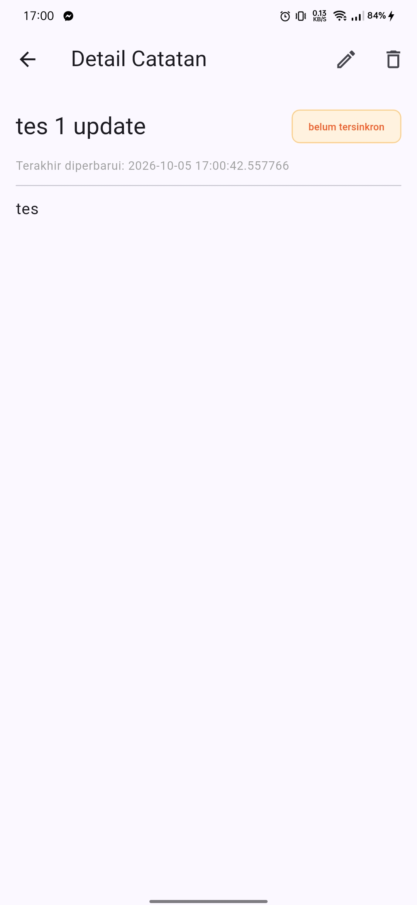

# Pertanyaan Refleksi
1. Mengapa daftar catatan tidak boleh disimpan di SharedPreferences? Apa yang rusak jika aturan ini dilanggar?
- Jawab: 
    Karena SharedPreferences hanya dirancang untuk menyimpan data dalam jumlah kecil, seperti preferensi atau pengaturan aplikasi (misalnya tema gelap/terang, status login). Menyimpan daftar catatan di SharedPreferences akan menimbulkan beberapa masalah serius:
    - Tidak Efisien untuk Data Besar: SharedPreferences menyimpan semua data dalam satu file XML. Jika jumlah catatan bertambah (misalnya ratusan atau ribuan), file tersebut akan menjadi sangat besar, yang akan memperlambat waktu buka aplikasi dan meningkatkan konsumsi memori.
    - Tidak Ada Query / Filtering: SharedPreferences tidak menyediakan fungsi pencarian, pemfilteran, atau pengurutan. Untuk menemukan catatan tertentu, kita harus memuat seluruh data ke memori dan mencarinya secara manual, yang sangat tidak efisien.
    - Tidak AdaTransaksi: SharedPreferences tidak mendukung transaksi. Jika terjadi kegagalan saat menulis data (misalnya listrik padam di tengah operasi), data bisa menjadi korup atau setengah tertulis.
    - Tidak Mendukung Relasi: Jika catatan memiliki relasi dengan data lain, SharedPreferences tidak dapat menanganinya dengan baik. Kita harus mengelola relasi secara manual menggunakan string atau ID.
    - Tidak Ada Skema yang Tepat: SharedPreferences tidak memiliki skema atau validasi tipe data. Ini berarti data bisa menjadi tidak konsisten jika tidak dikelola dengan hati-hati.
    
2. Kapan cache-first cukup, dan kapan Anda membutuhkan strategi lain (misalnya network-first untuk data harga real-time)?
- Jawab: 
    Strategi cache-first cukup efektif untuk data yang tidak memerlukan informasi real-time atau data yang sering berubah. Contohnya termasuk data preferensi pengguna, daftar catatan, atau data master yang jarang berubah. Dalam skenario ini, aplikasi dapat bekerja dengan baik meskipun tidak memiliki koneksi internet, karena data yang diperlukan sudah tersedia di cache.

    Namun, untuk data yang sangat dinamis atau memerlukan informasi terkini, strategi cache-first tidak lagi memadai. Contohnya termasuk data harga saham, kurs mata uang, status inventaris real-time, atau data log transaksi. Dalam kasus ini, strategi network-first menjadi lebih penting. Aplikasi akan selalu mencoba mengambil data terbaru dari server utama. Jika server tidak dapat dijangkau, barulah cache digunakan sebagai fallback. Hal ini memastikan bahwa pengguna selalu mendapatkan informasi yang paling akurat dan terkini.

    Selain itu, strategi cache-first mungkin tidak cocok untuk data yang sensitif terhadap waktu, di mana keterlambatan sedikit saja dapat menyebabkan masalah signifikan, seperti dalam aplikasi trading saham atau sistem navigasi real-time.

3. Bagaimana dirty flag berubah menjadi antrean sync tanpa memblokir UI? Kapan antrean terpisah (tabel outbox) menjadi perlu?
- Jawab: 
    Dirty flag berfungsi sebagai penanda bahwa ada perubahan data lokal yang belum disinkronkan ke server. Untuk mengubahnya menjadi antrean sync tanpa memblokir UI, kita dapat menggunakan pendekatan berikut:
    1.  Menandai perubahan: Saat pengguna melakukan perubahan pada data, application akan menandai data tersebut dengan dirty flag. Status ini disimpan secara lokal di database.
    2.  Background service/worker: Aplikasi kemudian akan menjalankan proses sinkronisasi di background. Proses ini akan memeriksa semua data yang ditandai dengan dirty flag.
    3.  Sinkronisasi bertahap: Proses sinkronisasi akan mengirimkan perubahan data ke server secara bertahap. Setiap kali data berhasil disinkronkan, dirty flag akan dihapus.
    4.  Reaksi terhadap koneksi: Jika koneksi internet terputus selama proses sinkronisasi, proses akan dihentikan sementara. Namun, status data (termasuk dirty flag) tetap tersimpan di database. Ketika koneksi pulih, proses sinkronisasi akan melanjutkan dari titik terakhir.

    Antrean terpisah (tabel outbox) menjadi perlu ketika aplikasi perlu menangani operasi yang kompleks, seperti pembaruan data dalam jumlah besar, operasi yang melibatkan multiple dependencies, atau operasi yang memerlukan urutan eksekusi yang ketat. Tabel outbox berfungsi sebagai buffer antara aplikasi dan server, memastikan bahwa semua operasi tetap tersimpan dan dapat dieksekusi dengan benar bahkan jika terjadi gangguan pada koneksi internet.
    
4. Bagian mana dari rekomendasi AI yang Anda tolak, dan mengapa?
- Jawab: 
    Meskipun rekomendasi AI memberikan panduan yang baik, saya memilih untuk tidak menggunakan rekomendasi AI untuk beberapa bagian, terutama mengenai struktur dan fitur tambahan yang mungkin tidak sesuai dengan kebutuhan project saat ini.
    
    1. Penggunaan Database Tambahan: AI menyarankan penggunaan database tambahan untuk cache. Namun, pada project ini, SQLite sudah cukup untuk kebutuhan caching dan penyimpanan data. Penambahan database akan menambah kompleksitas yang tidak perlu.
    2. Reaktivitas Real-time: AI menyarankan untuk menambahkan fitur reaktivitas real-time dengan menggunakan stream dari database. Namun, pada project ini, fitur tersebut belum diperlukan dan hanya akan menambah kompleksitas. Cukup dengan melakukan refresh manual saat diperlukan.
    3. Struktur Kode yang Lebih Kompleks: AI menyarankan untuk membagi repository menjadi beberapa modul dan menambahkan service layer terpisah. Sementara hal ini dapat meningkatkan modularitas, namun akan menambah overhead yang tidak diperlukan untuk project yang masih kecil. Pendekatan saat ini yang lebih sederhana sudah cukup memadai.
    4. Fitur Tambahan: AI menyarankan untuk menambahkan fitur-fitur seperti monitoring error, logging, dan notifikasi. Meskipun fitur tersebut penting untuk aplikasi skala produksi, namun tidak diperlukan untuk project saat ini yang fokus pada implementasi dasar offline-first.
    
    Keputusan untuk tidak mengimplementasikan fitur-fitur ini bukan berarti bahwa rekomendasi tersebut salah, melainkan untuk menjaga agar project tetap sederhana, mudah dikelola, dan sesuai dengan kebutuhan saat ini. Fitur-fitur tersebut dapat dipertimbangkan untuk ditambahkan di masa mendatang jika diperlukan.